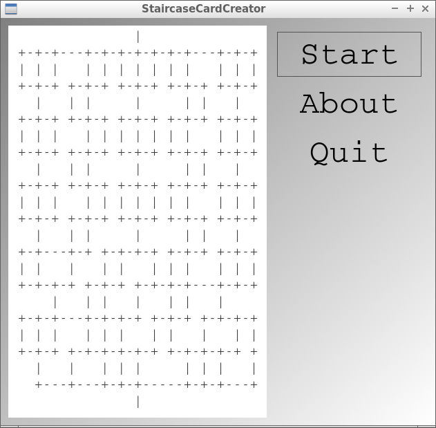

# StaircaseCardCreator

Branch||
---|---|---
master||

Tool to create staircase cards, written in C++ using Qt.

## Links

- [My hand-designed staircase cards](https://github.com/richelbilderbeek/staircase_card_creator)
