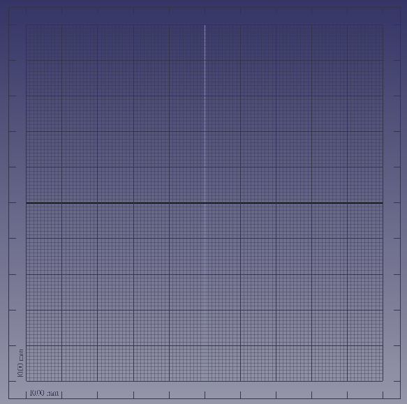
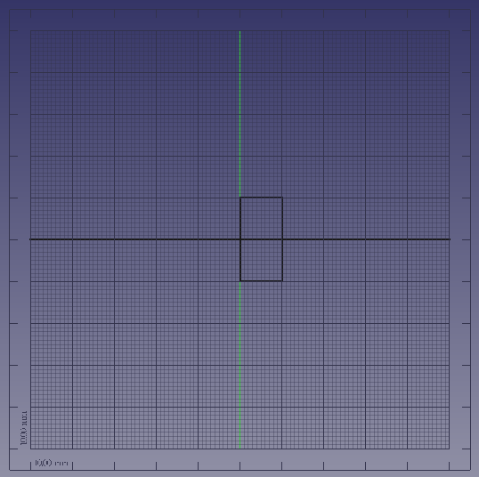
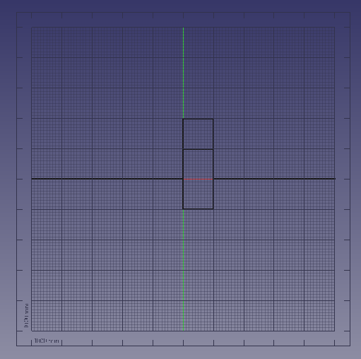
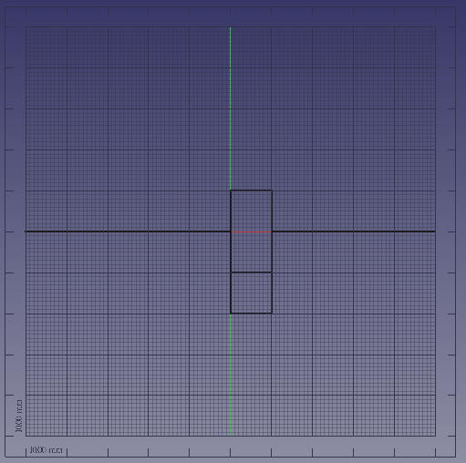

# Design

Here I show the basics on how to design a staircase card.

The most basic design is this:

It is a single horizontal line. When doing a half cut over that
line, you can fold it. Nothing more will happen,
but it is the most basic design and the basis for
the next step.

The most simple design that has an extrusion is this:

It will look like a cube sticking out, where the cube
is 1x1x1 units of length.

We can extend this cube in each direction.

Below is the design of a high cuboid. Note that
the main horizontal line is interrupted by the
high cuboid: the red line is the color FreeCAD gives
to its x axis.

Below is the design of a cuboid this is just as
high, but comes more towards the viewer. Note that,
also here,
the main horizontal line is interrupted by the
high cuboid: the red line is the color FreeCAD gives
to its x axis.

Below is the design of a cuboid this is wider. The vertical
Note that,
the main horizontal line is interrupted by the
high cuboid: the red line is the color FreeCAD gives
to its x axis.

