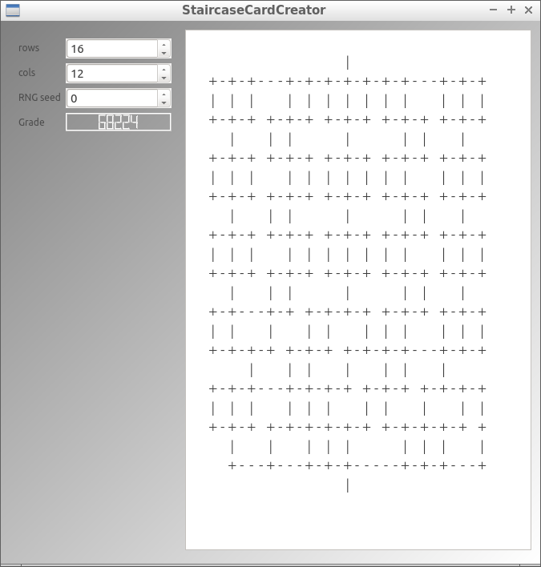
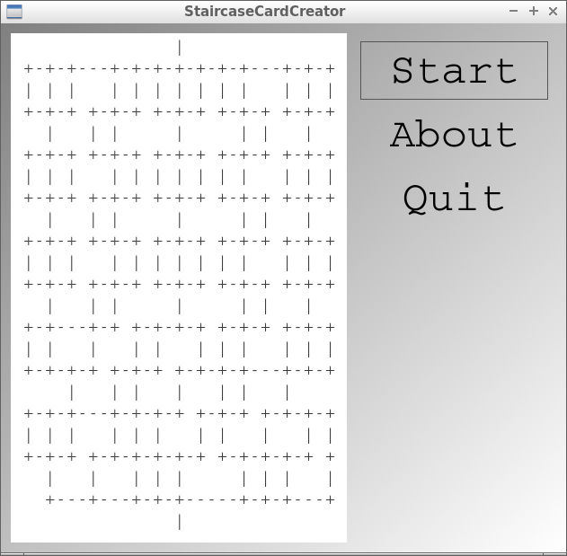

# StaircaseCardCreator

<!-- markdownlint-disable MD013 --><!-- Badges cannot be split up over lines, hence will break 80 characters per line -->

<!-- markdownlint-enable MD013 -->

Tool to create staircase cards, written in C++ using Qt.

## Links

- [My hand-designed staircase cards](https://github.com/richelbilderbeek/staircase_card_creator)
